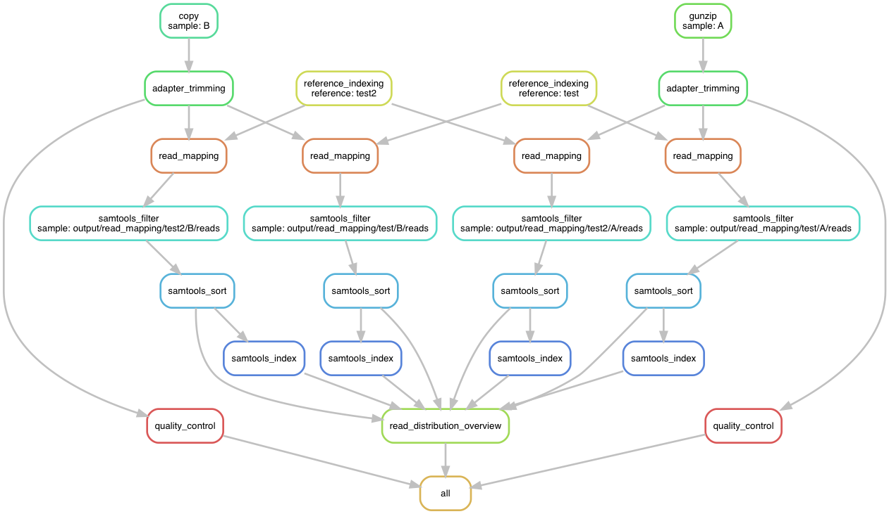

# SeqPipe (snakemake edition)

A sequencing pipeline based on Snakemake.


## Installation

Install [Snakemake](https://snakemake.readthedocs.io/en/stable/) in order to run the pipeline:

```bash
$ pip install snakemake
```

Furthermore, the following software is used:

* gzip
* FastQC
* BWA
* samtools
* cutadapt
* python 3.6
    * pysam
    * matplotlib
    * matplotlib_venn


## Usage

Set up `config.yaml` to your liking and execute the pipeline as follows:

```bash
$ snakemake -p
```

Create an overview of the pipeline:

```bash
$ snakemake --dag | dot -Tpng > overview.png
```

An exemplary pipeline DAG for aligning reads of the samples `A` and `B` to the references `test` and `test2` can be seen below.




## Notes

### Paired-end reads handling

This pipeline supports mapping single-end as well as paired-end reads.
It is assumed that paired-end reads are denoted using `R{1,2}` (e.g. `foo_R1.fastq.gz` and `foo_R2.fastq.gz`).
The corresponding results can then be found under the `R1` sample.
